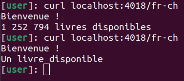

# bookstore-i18n

Example of usage i18n localization in Go project. 

As an example, simple web bookstore application created.

## Technological stack

- Usage of Go 1.20 version.
- Usage [bmizerany/pat](github.com/bmizerany/pat) - HTTP server router.
- Usage [x/text](https://pkg.go.dev/golang.org/x/text) - repository of text-related packages related to i18n and i10n. 

## Dependencies

- **go:generate** - cmd tool to generate code.
- [gotext](golang.org/x/text/cmd/gotext) - cmd tool to automate translate messages extracting.

## Commands

- Run project.
````
make run
````

- Generate translation message files for specified languges.
````
make generate
````

- Copy translation message files to required format.
````
make copy
````

## Example


